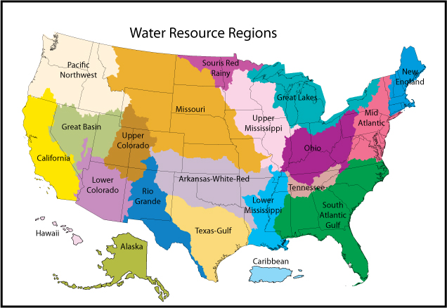
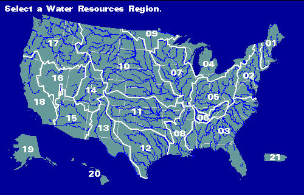

<!-- README.md is generated from README.Rmd. Please edit that file -->

# forecastCAMELS

<!-- badges: start -->
<!-- badges: end -->

`forecastCAMELS` contains `filtered_processed_datalist.RData` which
contains a small subset of the CAMELS data set (A. Newman; K. Sampson;
M. P. Clark; A. Bock; R. J. Viger; D. Blodgett, 2014) specifically
processed with the objective of training machine learning and
statistical models on the processed data for the purpose of building
streamflow forecasting models.

The subset was constructed based on the following conditions:

1.  Basin mean forcing
2.  Daymet
3.  USGS streamflow gauges with no missing streamflow records
4.  USGS streamflow gauges with less than 1% streamflow records being
    estimates

For CAMELS version 1.2, see
`\basin_timeseries_v1p2_metForcing_obsFlow\basin_dataset_public_v1p2\readme_streamflow.txt`
for details regarding points 3 and 4 above, and go through the first few
pages of <doi:10.5194/hess-19-209-2015> to make sense of points 1 and 2.

## Details

`filtered_processed_datalist.RData` contains an R `list` object named
`filtered_processed_datalist` which contains 35 data frames. Each list
element (a data frame) of `filtered_processed_datalist` has a name of
the form “HUC/GAGEID”, where “HUC” is the USGS hydrologic unit code
denoting a region, and “GAGEID” is the zero padded USGS stream gauge ID.
The images below show the HUC regions (the images were taken from
<https://water.usgs.gov/wsc/map_index.html> and
<https://water.usgs.gov/GIS/regions.html>, respectively.)

You may look at the text file `camels_names.txt` (which was included
with the original CAMELS data set) to find what stream location
corresponds to a particular gauge id.

My data processing code and instructions can be found in the folder
`processing_scripts`.

## Original (Full) CAMELS Data Set

Visit <https://ral.ucar.edu/solutions/products/camels> to download the
full CAMELS data set.

## Disclaimer

I am in no way affiliated with the good folks that created the CAMELS
data set. This repository was created to make my life easier for
research, and I have open sourced my code and data for anyone who might
find them useful.

## References

A. Newman; K. Sampson; M. P. Clark; A. Bock; R. J. Viger; D. Blodgett,
2014. A large-sample watershed-scale hydrometeorological dataset for the
contiguous USA. Boulder, CO: UCAR/NCAR.
<https://dx.doi.org/10.5065/D6MW2F4D>

A. J. Newman, M. P. Clark, K. Sampson, A. Wood, L. E. Hay, A. Bock, R.
J. Viger, D. Blodgett, L. Brekke, J. R. Arnold, T. Hopson, and Q. Duan:
Development of a large-sample watershed-scale hydrometeorological
dataset for the contiguous USA: dataset characteristics and assessment
of regional variability in hydrologic model performance. Hydrol. Earth
Syst. Sci., 19, 209-223, <doi:10.5194/hess-19-209-2015>, 2015
